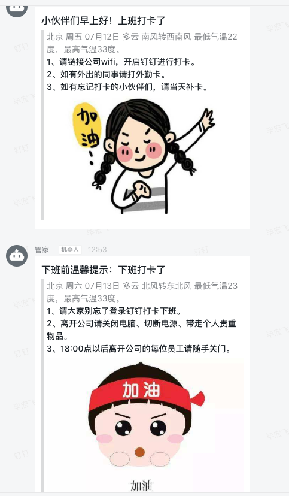

# 钉钉群机器人提醒
### 功能描述
使用钉钉打办公的同学们，有时候会经常忘记打卡。在工作中经常会有行政同学提醒关灯、关空调、窗户等，包括提醒同事们天气情况。现在使用DingRemind可以按时自动化的把这些贴心小提示发给钉钉群的小伙伴，告别行政重复性工作。

### 1.创建钉钉群机器人

**添加群机器人，获取机器人的webhook，记录下来**

### 2.注册图灵机器人  
[图灵机器人](http://www.tuling123.com)

- 创建机器人
- 点击机器人获取apikey

### 3.修改脚本
替换remind.py中12行钉钉的webhook为步骤1获取的，21行的apikey为步骤2获取到

### 4.计划任务
写个定时计划任务分别对应上班跟下班

```
crontab -e
50 8 * * * python remind.py 0
50 17 * * * python remind.py 1
```

### 5.显示效果

  
**上班显示今天的天气预报，下班显示明天的天气预报**

### 后序
图灵机器人知识库种类奇多，完全可以定制各种不同的信息发送，例如菜谱群、星座运势群等等，钉钉机器人发送模式众多，可以根据[开发文档](https://open-doc.dingtalk.com/microapp/serverapi2/qf2nxq)自己考核
